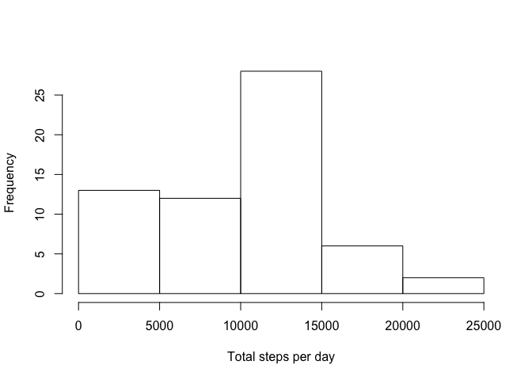
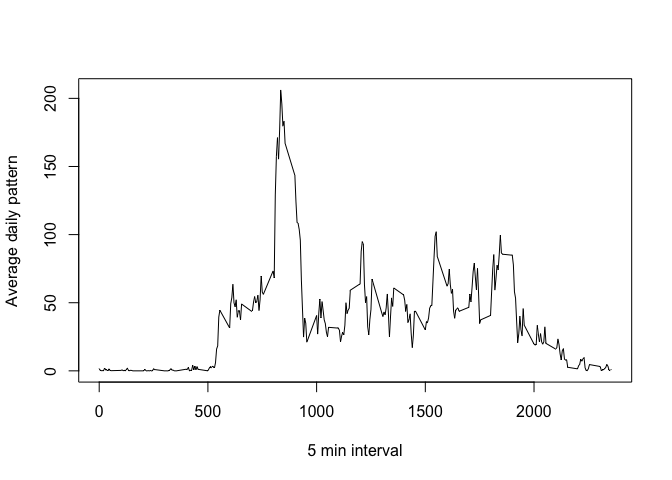
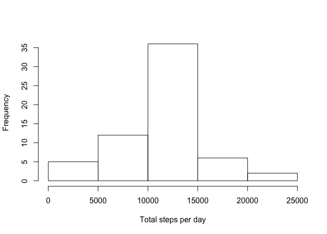
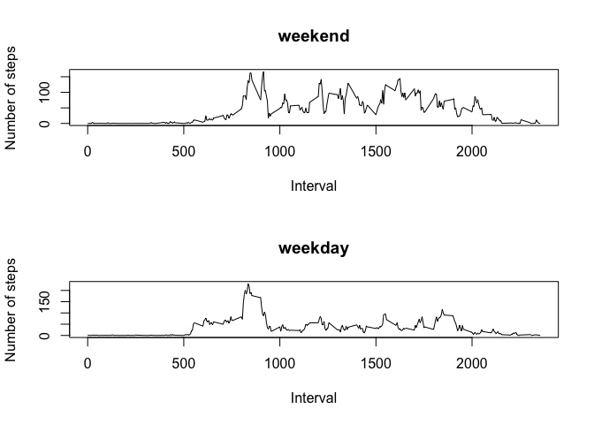

## Loading and preprocessing the data
The data has to be first unzipped, then imported, then the date field has to be changed into a proper format.


```r
## read the data
unzip ("activity.zip")
d <- read.csv("activity.csv")

## transform the date field into a proper format
library(dplyr)
```

```
## 
## Attaching package: 'dplyr'
```

```
## The following objects are masked from 'package:stats':
## 
##     filter, lag
```

```
## The following objects are masked from 'package:base':
## 
##     intersect, setdiff, setequal, union
```

```r
d <- mutate (d, date = as.Date(as.character(date), "%Y-%m-%d"))
```

## What is mean total number of steps taken per day?
An histogram helps to visualize the trend.


```r
## calculate the number of steps per day
s <- group_by(d,date)
s <- summarise(s, total_steps_per_day=sum(steps,na.rm = TRUE))

## plot an histogram based on the number of steps per day
hist(s$total_steps_per_day,xlab="Total steps per day",main = "")
```

<!-- -->

```r
## calculate and report mean and median of the number of steps per day
steps_mean <- mean(s$total_steps_per_day)
print (paste("Mean of steps per day is",steps_mean))
```

```
## [1] "Mean of steps per day is 9354.22950819672"
```

```r
steps_median <- median(s$total_steps_per_day)
print (paste("Median of steps per day is",steps_median))
```

```
## [1] "Median of steps per day is 10395"
```

## What is the average daily activity pattern?
A plot can help to better understand.


```r
## plot the average number of steps per interval, calculated across all days
p <- group_by(d,interval)
p <- summarise(p,avg_daily_pattern = mean(steps,na.rm = TRUE))
plot(p$interval,p$avg_daily_pattern,type="l",xlab="5 min interval",ylab="Average daily pattern")
```

<!-- -->

```r
## get the interval with highest average of steps 
interval_max <- filter(p,avg_daily_pattern == max(p$avg_daily_pattern))$interval
print (paste("The interval with highest average daily pattern is",interval_max))
```

```
## [1] "The interval with highest average daily pattern is 835"
```

## Imputing missing values
Missing values are replaced with the average daily value for the corresponding interval.


```r
## calculate the number of rows with NAs
mis_val <- sum(!(complete.cases(d)))
print (paste("The number of rows with missing values is",mis_val))
```

```
## [1] "The number of rows with missing values is 2304"
```

```r
## replace the NAs with the average daily value for the corresponding interval
d1 <- d     ## create a copy
for (i in (1:length(d1$interval))) {
   if (is.na(d1[i,]$steps))  { d1[i,]$steps = filter(p,interval == d1[i,]$interval)$avg_daily_pattern}
}

## re-create the histogram and re-compute the values, based on this new dataset with no missing values
s1 <- group_by(d1,date)
s1 <- summarise(s1, total_steps_per_day=sum(steps,na.rm = TRUE))
hist(s1$total_steps_per_day,xlab="Total steps per day",main = "")
```

<!-- -->

```r
steps_mean1 <- mean(s1$total_steps_per_day)
print (paste("New mean of steps per day is",steps_mean1))
```

```
## [1] "New mean of steps per day is 10766.1886792453"
```

```r
steps_median1 <- median(s1$total_steps_per_day)
print (paste("New median of steps per day is",steps_median1))
```

```
## [1] "New median of steps per day is 10766.1886792453"
```

## Are there differences in activity patterns between weekdays and weekends?
Two plots help to see how weekend days are registering more activity.


```r
## introduce a new factor variable "weekday"/"weekend"
weekends <- c("Saturday","Sunday")
d1 <- mutate(d1,day = factor (weekdays(date) %in% weekends,levels=c("TRUE","FALSE"),labels=c("weekend","weekday")))

## compute and plot the average across this new variable, per interval
p1 <- group_by(d1,day,interval)
p1 <- summarise(p1,avg_pattern=mean(steps))
p1a <- filter(p1,day=="weekend")
p1b <- filter(p1,day=="weekday")
par(mfrow=c(2,1))
plot(p1a$interval,p1a$avg_pattern,type="l",main="weekend",xlab="Interval",ylab="Number of steps")
plot(p1b$interval,p1b$avg_pattern,type="l",main="weekday",xlab="Interval",ylab="Number of steps")
```

<!-- -->
